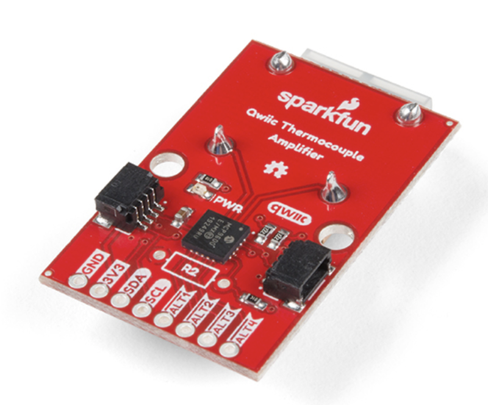
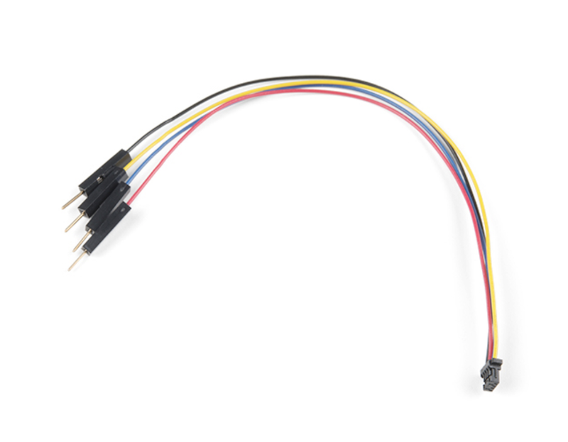

# AN018 Tracker Thermocouple

The full code examples for this application note can be found in the [Github repository](https://github.com/particle-iot/app-notes/tree/master/AN019-Tracker-Thermocouple) for this project.


This application note shows how to transition from prototyping with off-the-shelf Qwiic sensors to making your own Tracker One M8 expansion board.

## Prototyping with the Tracker SoM Evaluation Board

I2C is a common way to expand the Tracker One using the M8 connector. If you wanted to use a K-type thermocouple, you might prototype with these off-the-shelf components from Sparkfun:

- [SparkFun Qwiic Thermocouple Amplifier - MCP9600 (PCC Connector)](https://www.sparkfun.com/products/16294) $24.95



- [Thermocouple K-Type](https://www.sparkfun.com/products/13715) $4.95

- [Qwiic connector to prototyping wires](https://www.sparkfun.com/products/14425) $1.50 or [Cable assortment](https://www.sparkfun.com/products/15081)



All Qwiic devices use I2C at 3.3V. You'll need to connect four pins on the evaluation board expansion connector:

| Color  | Pin  | Purpose |
| :----- | :--- | :--- |
| Blue   | D0   | SDA (I2C data) |
| Yellow | D1   | SCL (I2C clock) |
| Red    | 3V3  | Power 3.3V |
| Black  | GND  | Ground |

## Firmware

### Getting the Tracker Edge Firmware

The Tracker Edge firmware can be downloaded from Github:

[https://github.com/particle-iot/tracker-edge](https://github.com/particle-iot/tracker-edge)

After downloading the source, you will need to fetch the library dependencies. This can be done from a command prompt or terminal window with the git command line tools installed:

```
cd tracker-edge
git submodule init
git submodule update --recursive
```

Be sure to target 1.5.4-rc.1 or later for your build. Device OS 1.5.3 or later is required, only version 1.5.4-rc.1 and later are available in the full set of tools including Workbench, CLI, and Web IDE.

### Add the libraries

From the command palette in Workbench, **Particle: Install Library** then enter **SparkFun_MCP9600_Arduino_Library**. 

If you prefer to edit project.properties directly, add these:

```
dependencies.SparkFun_MCP9600_Arduino_Library=1.0.3
```

### The Source


